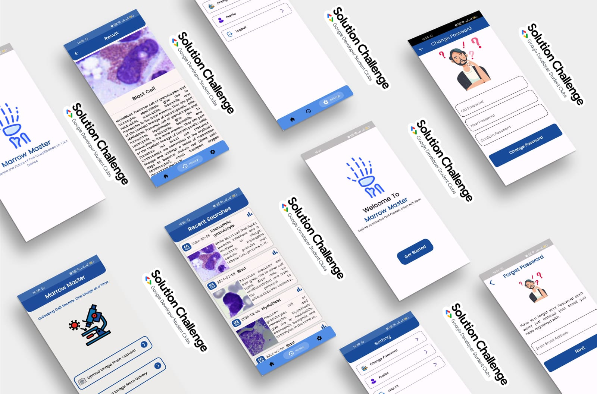

<div align="center">
    <div >
        
    </div>
    <div >
            <p style="font-size:50px;"><b>Marrow Master</b></p>
            <p style="font-size:18px"><i>Experience the future of cell</i></p>
    </div>      
</div>
<br>

<h1 align="center">MarrowMaster Application</h1>

The <b>Marrow Master application</b> presents users with a simplified and streamlined interface that highlights only the most relevant information for each user.
<br>
<br>
  <div >
        
    </div>
<be>
<br>
<h2>👨🏻‍💻 Technology Stack</h2>
<br />
<div align="center">
    <kbd>
        
    </kbd>
    <kbd>
        
    </kbd>
    <kbd>
        
    </kbd>
    <h4>Flutter | Dart | Firebase</h4>
</div>

<br>

# Getting Started

This repo contains the <b>Frontend application</b> for Marrow Master. Click [here](https://github.com/GDSC-cuiatd/marrow_master) to view the full solution.
<br><br>
[Flutter `(Version 3.16.7 • channel stable)`](https://docs.flutter.dev/get-started/install) must be installed to run this application.

## ⚙️ &nbsp;Steps to Setup

1. Clone Repo

```
$ git clone https://github.com/GDSC-cuiatd/marrow_master/automated_bone_marrow_cell_classification_system
```

2. Run the following code in bash to install the required dependencies

```
$ cd automated_bone_marrow_cell_classification_system
$ flutter pub get
```

3. Launch Application

```
$ flutter run [--release]
```
<br>

## 🔑 &nbsp;Files and Directories

```tree
├── android
├── assets
├── ios
├── lib
│   ├── controller
│   |   ├── auth_controller
|   |   |   |── change_password_controller.dart
|   |   |   |── forget_password_controller.dart
|   |   |   |── login_screen_controller.dart
|   |   |   |── register_screen_controller.dart
│   |   └── home_main_controller
|   |   |   |── history_controller
|   |   |   |   |── history_controller.dart
|   |   |   |── home_screens_controller
|   |   |   |   |── home_controller.dart
|   |   |   |── setting_screen_controller
|   |   |   |   |── logout_controller.dart
│   ├── data
│   |   ├── network
|   |   |   |── base_api_service.dart
|   |   |   |── network_api_service.dart
│   |   ├── repository
|   |   |   |── home_repository.dart
│   |   ├── app_exception.dart
│   ├── View
│   |   ├── auth_screen
|   |   |   |── change_password_screen.dart
|   |   |   |── forget_password_screen.dart
|   |   |   |── login_screen.dart
|   |   |   |── register_screen.dart
│   |   ├── home_screen
|   |   |   |── history_screen
|   |   |   |   |── history_screen_component
|   |   |   |   |   |── view_history_container.dart
|   |   |   |   |── history_screen.dart
|   |   |   |── home_screen_component
|   |   |   |   |── upload_button.dart
|   |   |   |── result_screen
|   |   |   |   |── result_screen.dart
|   |   |   |── setting_screen
|   |   |   |   |── setting_screen_component
|   |   |   |   |   |── about_us_screen.dart
|   |   |   |   |── profile_screen.dart
|   |   |   |   |── setting_screen.dart
|   |   |   |── home_main_screen.dart
|   |   |   |── home_screen.dart
│   |   ├── on_boarding_screen
|   |   |   |── onBoard_screen.dart
|   |   |   |── splash_screen.dart
│   |   ├── otp_screen.dart
│   ├── firebase_option.dart
│   └── main.dart
├── linux
├── macos
├── test
├── web
├── windows
├── .gitignore
├── .metadata
├── README.md
├── analysis_options.yaml
├── pubspec.lock
├── pubspec.yaml
```

<br>

## 👥 &nbsp;Contributors

| <a href="https://github.com/rizwanshah123"></a> | <a href=""></a> | <a href=""></a> | <a href=""></a> |
| ---------------------------------------------------------------------------------------------------------------------------------------------------------------------------------------------------------------------------------- | ----------------------------------------------------------------------------------------------------------------------------------------------------------------------------------------------------------------------------------- | -------------------------------------------------------------------------------------------------------------------------------------------------------------------------------------------------------------------------- | ----------------------------------------------------------------------------------------------------------------------------------------------------------------------------------------------------------------------------- |
| <div align="center"><h3><b><a href="https://github.com/rizwanshah123">Rizwan Shah</a></b></h3><p><i>Cui Atd</i></p></div>                                                                               | <div align="center"><h3><b><a href="">Rida Zainab</a></b></h3></a><p><i>Cui Atd</i></p></div>                                                                          | <div align="center"><h3><b><a href="">Areeb Ajab</a></b></h3></a><p><i>Cui Atd</i></p></div></a>                                                               | <div align="center"><h3><b><a href="">Maha Babar</a></b></h3></a><p><i>Cui Atd</i></p></div>
